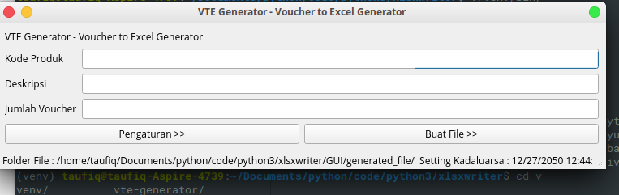
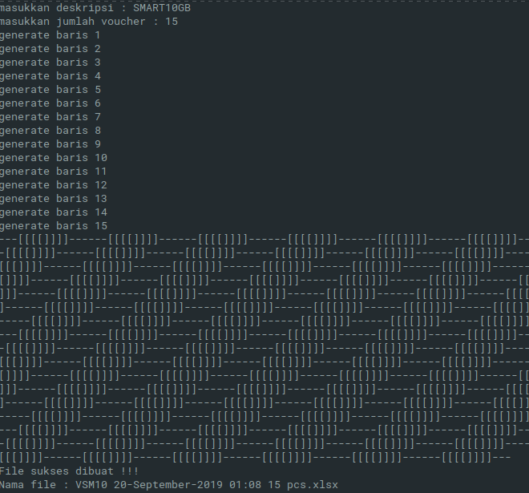

# Voucher to Excel Generator


- screenshot program versi GUI



Program sederhana untuk men-generate secara otomatis file import voucher kedalam bentuk file excel.

## Cara pakai
install terlebih dahulu package python yang dibutuhkan utk aplikasi ini,

1. PyQt5 utk GUI nya
2. xlsxwriter utk membuat file excel nya

```bash
pip install -r /path/to/requirements.txt
```

***sangat disarankan untuk menggunakan virtual environment***

Pemakaian dari aplikasi ini cukup mudah, jika anda ingin pakai versi CLI , tinggal pindah direktori CLI, kemudian eksekusi app.py. Lalu isikan data sesuai permintaan ,

Sementara untuk versi GUI , masuk direktori GUI, lalu eksekusi runner.py.
